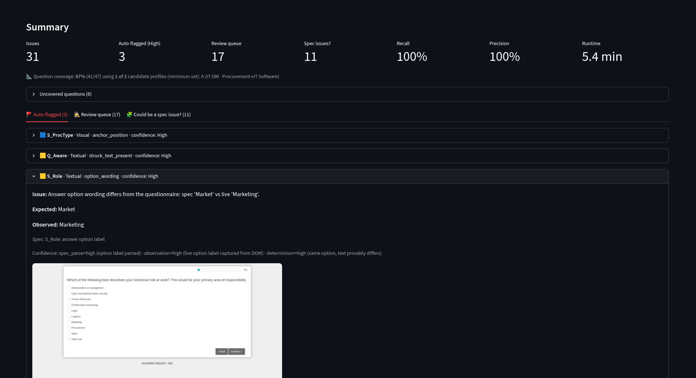
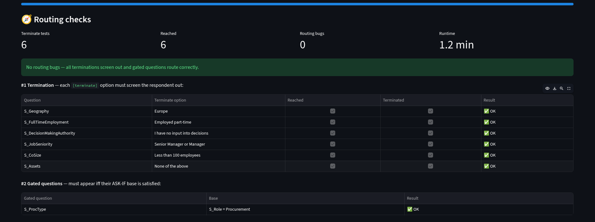
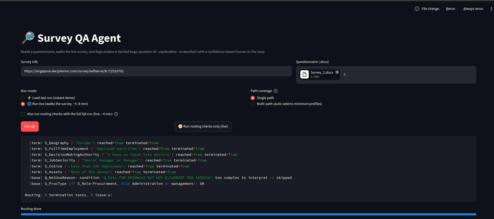

# 🔎 Survey QA Agent

An agent that checks whether a programmed survey matches its questionnaire. It reads a
questionnaire (`.docx`), **walks the live survey like a respondent**, and flags every place
the two diverge — each finding backed by a **question ID, a plain explanation, and a
screenshot**, and sorted by how much to trust it.

Built for the market-research QA problem where a human today spends **6–10 hours** clicking
through a survey with the questionnaire open beside them.



---

## The idea in one line

> Parse the questionnaire → drive the live survey → flag every disagreement, with proof,
> ranked by confidence.

```
 Questionnaire.docx ─┐
                     ├─►  PARSE ──► spec JSON  ("what SHOULD be")
 Live survey URL ────┴─►  WALK  ──► observations JSON ("what IS") + screenshots
                                          │
              DETECT (4 tiers) ─► issues ─► TRIAGE (3 buckets) ─► Streamlit report
```

Everything runs behind a Streamlit UI (demo mode loads a cached run instantly; live mode
drives headless Chromium).

---

## Detection tiers — different bugs need different mechanisms

The core design principle: **you can't catch every bug the same way.** Reading a page,
trying a bad value, and driving a routing path are fundamentally different acts.

| Bug class | How you must detect it | Mechanism | Trust |
|---|---|---|---|
| **Visual** (option order, anchor position) | look at the captured DOM order | deterministic | High → auto-flag |
| **Textual** (wording, struck text, option label) | compare spec text vs live text | deterministic **+ a strict LLM net** for dynamic text | High deterministic → auto-flag; LLM → review |
| **Validation** (ranges, format, required) | *try a bad value*, see if it's accepted | active **probe** | High → auto-flag |
| **Routing** (terminate, show/skip, branch) | *drive a specific path*, check the flow | active **routing test** | High → auto-flag |

### 1. Textual + Visual (the first category we built)
Deterministic checks that compare the parsed spec against the live DOM, **no LLM required**:
- **Visual** (`src/visual_checks.py`): anchor-at-bottom (catches *S_ProcType* — "Other" not
  pinned last), fixed-order and alphabetical checks (precision-gated so parser noise can't
  false-flag).
- **Textual** (`src/textual_checks.py`): struck-text-still-shown (catches *Q_Aware* — "if
  any," was deleted in the doc but appears live), option-wording diff (catches the seeded
  *S_Role* bug — spec "Market" vs live "Marketing"), unresolved-placeholder, and a gated
  question-stem word-diff.

**Where the LLM earns its place — and where it doesn't.** An LLM can *read* a page but
*can't observe behaviour*. So the LLM (`src/openworld.py`, `src/llm.py`) is boxed to
**textual wording only**, and — because prompts alone don't hold it — its output is
**programmatically filtered** (fixed category enum + a deny-list). Early on it hallucinated
validation/grid/order "bugs"; the filters and scope now keep it to genuine wording issues,
routed to a **review queue**, never auto-flagged.

### 2. Routing (the harder tier)
Routing bugs are about *flow* — which question shows, skips, or ends the survey — so you
can't see them on one page. Each check **derives a test case from the spec, drives that
exact path, and asserts the outcome** (`src/routing.py`):

- **#1 Termination** — for every `[terminate]` option: walk to that question, **select the
  terminate option**, and assert the survey **screens out** (Decipher end = no question div +
  no continue button, "Survey Completed – Thank You"). On Survey 2, **20/20 terminate options
  fired correctly.** We proved the detector isn't a rubber stamp by running it on a
  *non*-terminate option — it correctly reported "did not terminate."
- **#2 Gated questions** — for each `ASK IF` condition: run one path that **satisfies** the
  base (assert the question **appears**) and one that **violates** it (assert it's **absent**).
  *S_ProcType* (shown only if `S_Role = Procurement`) passed both.



*Live routing run — the agent drives each `[terminate]` path and asserts screen-out:*



**Deriving the qualifying path** is the crux, and it's **spec-driven, no LLM**: default every
question to a **non-`[terminate]`** answer (read from the spec's terminate flags), then **pin**
the specific answers a target's `ASK IF` requires — resolved by a small **condition
interpreter** (`src/spec_logic.py`, e.g. `S_ROLE=8` → the 8th option → "Procurement").

### Validation (active probes)
`src/probe.py` enters boundary/invalid values (e.g. 19,000,000 at a price field, junk in a
phone field) and checks whether the survey wrongly proceeds — because a numeric cap or format
rule only reveals itself when you *try* it, never by looking.

---

## Coverage — reaching every question with the fewest walks

A survey is *routed*, so one answer profile only unlocks one branch. Naively you'd walk a
path per question — but **one path already covers a whole chain**, so the real task is the
**minimum set of paths whose union covers all questions** (a set-cover / minimum-path-cover
problem).

We implemented **greedy set-cover over spec-generated candidates** (`src/coverage_greedy.py`):
1. **Generate candidate paths from the spec** — a base profile + one per role/branch option +
   one per resolvable `ASK IF` gate. On Survey 2 this auto-produces **11 candidates**, no LLM.
2. **Greedy-select the minimum** — repeatedly add the profile that covers the most
   still-uncovered questions, stop when none adds anything.
3. **Walk only the selected paths** (reusing cached walks) and check the union.

The UI shows the **paths-to-run count the greedy chose** ("1 of 11 candidates → 87–89%
coverage"). On Survey 2, one base profile covers ~89% at spec-question granularity; the
remainder is the deep *Axonius currently-use* chain, which needs multi-level back-chaining
(named limitation below).

---

## Confidence & the human-in-the-loop

Every issue carries a **decomposed confidence** — `f(spec-parse certainty, survey-observation
certainty, check determinism)` — and lands in one of three buckets (`src/aggregate.py`):

- **🚩 Auto-flagged** — deterministic, provable findings (visual, deterministic-textual,
  validation, routing). The trusted tier.
- **🕵️ Review queue** — the LLM textual net and anything Med confidence. A human confirms.
- **🧩 Could be a spec issue?** — where the divergence looks like the *questionnaire* is
  incomplete/ambiguous, not a survey bug.

This *is* the human-in-the-loop: the agent triages 6–10 hours of clicking into a short,
ranked, evidence-backed list; the human owns the judgment calls and the final accept/reject.
Only *provable* things auto-flag — precision-first, so alarms stay trustworthy.

---

## Results on the test survey (Survey 2)

- **3 real bugs auto-flagged** — S_ProcType (Visual), Q_Aware (Textual struck-text), S_Role
  (Textual option-wording) — **recall 100%, precision 100%**, every one with a screenshot.
- **Routing: 20/20 terminations correct, S_ProcType gate correct, 0 routing bugs** (a true
  negative — Survey 2's routing is clean, and the detector is proven able to catch a break).
- **Coverage: ~89% with 1 greedy-selected path.**

---

## Repo layout

| File | Role |
|---|---|
| `src/parse_spec.py` | docx → structured spec JSON (strike-through, options+order, terminate flags, ASK-IF, validation) |
| `src/runner.py` | Playwright walk of the live survey → observations + screenshots |
| `src/visual_checks.py` / `src/textual_checks.py` | deterministic Visual / Textual checks |
| `src/openworld.py`, `src/llm.py` | strict LLM textual net (filtered, review-queue only) |
| `src/probe.py` | active validation probes |
| `src/routing.py`, `src/spec_logic.py` | routing tests (#1 termination, #2 gated) + condition interpreter |
| `src/coverage_greedy.py`, `src/multipath.py` | candidate generation + greedy set-cover coverage |
| `src/aggregate.py` | triage, scoring, report |
| `app.py` | Streamlit UI |

---

## Run it

**Locally**
```bash
pip install -r requirements.txt
python -m playwright install chromium
streamlit run app.py         # http://localhost:8501
export ANTHROPIC_API_KEY=...  # optional; enables the LLM textual net
```
**Deploy** (Streamlit + Chromium need a persistent container, not serverless) — see
[`DEPLOY.md`](DEPLOY.md) for Render / Fly.io with the bundled `Dockerfile`.

---

## What we could have improved

- **Use an LLM to extract the spec → JSON directly, instead of fixed heuristics.** The parser
  today is a set of deterministic rules tuned to **Decipher's conventions** (bracketed
  markers, `[terminate]`, `PIPE`, `ASK IF`). That's fast, free, and reproducible — but it's
  **brittle to format changes**, and we felt that brittleness repeatedly: `END` matching
  `Endpoint` and dropping an option, an `ASK IF` attaching to the wrong question, option lists
  over-capturing trailing tables. An **LLM-based extraction** (docx → structured JSON) would
  generalize across questionnaire formats far better. We deliberately chose heuristics under
  the assumption that **specs would follow a Decipher-like format** — a reasonable scoping bet
  for this task — but if that assumption breaks, LLM-assisted parsing (with a schema +
  validation) is the more robust foundation, and much of the downstream flakiness traces back
  to imperfect parsing rather than the checks themselves.
- **Multi-level back-chaining for 100% coverage** — the candidate generator does role +
  single-level gate pins; reaching deep chains (e.g. Axonius *currently-use* → Q_Current →
  Q_UseDr) needs recursive back-chaining of `ASK IF` dependencies.
- **A fuller condition interpreter** — compound (`A AND B`), range/set, and instruction-level
  terminate rules ("terminate if role ≠ …") that aren't attached to a single option.
- **Fork-at-branch + parallel walks** — paths share a long screener prefix; snapshotting the
  session at branch points (or parallelizing) would cut redundant re-walking.
- **Calibrated confidence** — with only a few labeled bugs, "High = 95% precision" is a claim,
  not a measurement; a larger seeded ground-truth set would make the tiers verifiable.
- **Robustness to the live product** — sample variants (`_vis`), loop-page text extraction,
  and test-link/quota behaviour on Decipher are handled pragmatically but could be hardened.

---

*Built as a scoped, measurable vertical slice: catch the highest-value bug types with
evidence and honest confidence, keep a human in the loop, and name the trade-offs.*
